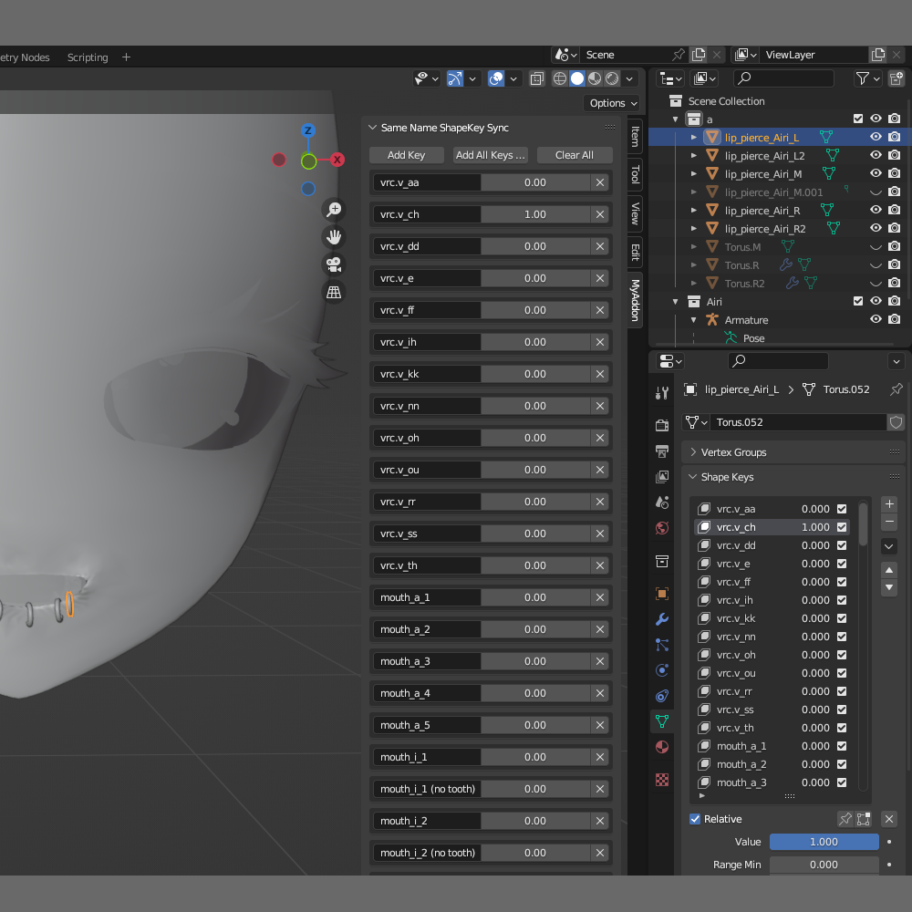

# Same Name Key Sync

A blender addon that lets you sync shape key values across all objects in the scene that have shape keys with the same name.

Expected use case: You are making an outfit or accessory for a VRChat avatar, and you want to sync the shape key values of the outfit/accessory with the shape keys of the avatar. This addon will allow you to do that easily.

# How to use
1. Install the addon in Blender.
2. In the 3D View, open the sidebar (press N) and go to the "MyAddon" tab.
3. In the "Same Name ShapeKey Sync" panel, you can add shape key names to the list. ("Add All Keys from Selected" will add all shape key names from the selected objects to the list.)
4. When you change the value in that panel, it will automatically update the value of all shape keys with the same name across all objects in the scene.

# Note
- This addon syncs shape key values only when you change the value in the "Same Name ShapeKey Sync" panel. It does not sync shape key values when you change them in the shape key editor or in the object properties.